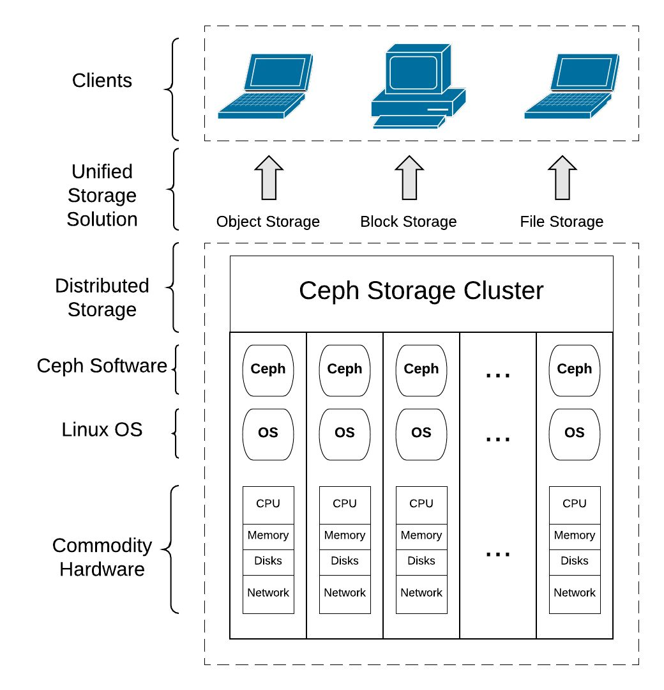

<h2>Ceph intro:</h2>
Ceph is an open source project that provides a solution for *software-defined*, *network-available* storage with high performance and *no single point of failure*. It is designed to be highly scalable to the exabyte level and beyond while running on general-purpose commodity hardware.
To learn more about what is ceph and how useful it is let's review it's philosophy
Ceph's architectural philosophy:

* Every component must be scalable
* No individual process, server, or other component can be a single point of failure
* The solution must be software-based, open source, and adaptable
* Ceph software should run on readily available commodity hardware without vendor lock-in
* Everything must be self-manageable wherever possible

The foundation of Ceph is objects. Any flavor of data, be it a block, object, or file, is represented by objects within the Ceph backend. Object storage is the flexible solution for unstructured data storage needs today and in the future

Ceph can provide a unified storage solution in a way that it provides block storage , file storage and object storage



<h2>Ceph installation using ceph-ansible:</h2>

It is supposed that you are using Centos8 as your base operating system.

```
sudo yum -y update
sudo yum -y install epel-release
```

You must install the latest pip version

```
sudo yum -y install python3-pip
sudo pip3 install --upgrade pip
```

Because ceph installation includes so many steps we will use ceph-ansible to do our job , we just provide it our desired configurations and list our nodes in an inventory.

```
git clone https://github.com/ceph/ceph-ansible.git
cd ceph-ansible
#choose the version of ceph-ansible
git checkout $branch 
#I went with version 5.0 stable
git checkout stable-5.0
```
Use pip and the provided requirements.txt to install Ansible and #other needed Python libraries - Ansible would be compatible in this way-

```
sudo pip3 install -r requirements.txt
#check ansible installation
ansible --version # THE OUTPUT : ansible 2.9.7
```

on cephadmin make an ssh key & copy the key to all other hosts
```
ssh-keygen
ssh-copy-id root@cephmon01
```

Create an ansible inventory file 
```
vim hosts #you can use vi or nano instead
```

For the sake of deployment we will have an admin node which runs ceph-ansible , 1 mon for the sake and we will extend it later

```
[mons]
cephmon01

# MDS Nodes
[mdss]
cephmon01

# RGW
[rgws]
cephmon01

# Manager Daemon Nodes
[mgrs]
cephmon01

# set OSD (Object Storage Daemon) Node
[osds]
cephmon01

# Grafana server
#[grafana-server]
#cephmon01
```

In order to deploy ceph we need to change group variables 

```
cp group_vars/all.yml.sample  group_vars/all.yml
vim group_vars/all.yml
```

Edit the file to configure your ceph cluster

```
ceph_release_num: 15
cluster: ceph

# Inventory host group variables
mon_group_name: mons
osd_group_name: osds
rgw_group_name: rgws
mds_group_name: mdss
nfs_group_name: nfss
rbdmirror_group_name: rbdmirrors
client_group_name: clients
iscsi_gw_group_name: iscsigws
mgr_group_name: mgrs
rgwloadbalancer_group_name: rgwloadbalancers
grafana_server_group_name: grafana-server

# Firewalld / NTP
configure_firewall: False
ntp_service_enabled: true
ntp_daemon_type: chronyd

# Ceph packages
ceph_origin: repository
ceph_repository: community
ceph_repository_type: cdn
ceph_stable_release: octopus

# Interface options
monitor_interface: eth1
radosgw_interface: eth1

#You may need to define public for communicating with clients and #private network for replicas by the way it isn't mandatory but it #is highly suggested
public_network: "192.168.10.0/24"

#cluster_network: "192.168.4.0/24" if you don't define this network it will default on public network that you've provided

#Afterwards we need to modify OSD configurations
cp group_vars/osds.yml.sample group_vars/osds.yml
vim group_vars/osds.yml


#There are a handful of ways to initiate your disks the easiest way would be to use 
osd_auto_discovery: True
#The other option could be to define your devices explicitly
#devices:
#  - /dev/sdb

#osd_scenario: collocated
#You can also define your collocated: journals are stored #alongside data. The cluster will lose performance.
#non-collocated: journals are stored on dedicated_devices 
#lvm: uses LVM to achieve a non-collocated scenario.

#osd_objectstore: bluestore
#either bluestore or filestore

```

Now run your play book

```
cp site.yml.sample site.yml
ansible-playbook -i hosts -u centos site.yml
```

<h2>Configuring ceph client and ceph block storage(RBD):</h2>

In order to create rbd first we need to configure a client ,ssh to client and check for RBD support in the kernel

```
modprobe rbd
echo $? # the output must be 0
```

Allow monitor node to access this client over ssh through ssh-copy-id

```
ssh-copy-id client-node1
```

Add the ceph client to the ceph-ansible inventroy file

```
[clients]
client-node1
```

Go to the /etc/ansible/group_vars directory on ceph-node1 and #create a copy of clients.yml from the clients.yml.sample :

```
cp clients.yml.sample clients.yml
```

Run ansible playbook

```
ansible-playbook -i hosts site.yml
```
On client-node1 check and validate that the keyring and ceph.conf file were populated into the /etc/ceph directory by Ansible there must be ceph.client.admin.keyring

On client-node1 you can validate that the Ceph client packages were installed by Ansible:

```
rpm -qa | grep ceph
```

The client machine will require Ceph keys to access the Ceph cluster. Ceph creates a default user, client.admin , which has full access to the Ceph cluster and Ansible copies the client.admin key to client nodes. It's not recommended to share client.admin keys with client nodes. A better approach is to create a new Ceph user with separate keys and allow access to specific Ceph pools. In our case, we will create a Ceph user, #client.rbd , with access to the RBD pool . By default, Ceph Block Devices are created on the RBD pool :

```
ceph auth get-or-create client.rbd mon 'allow r' osd 'allow class-read object_prefix rbd_children, allow rwx pool=rbd'
```

Add the key to client-node1 machine for client.rbd user:

```
ceph auth-get-or-create client.rbd | ssh client-node1 sudo tee /etc/ceph/ceph.client.rbd.keyring
```

By this step, client-node1 should be ready to act as a Ceph client. Check the cluster status from the client-node1 machine by providing the username and secret key:

```
cat /etc/ceph/ceph.client.rbd.keyring >> /etc/ceph/keyring
ceph -s --name client.rbd
```

<h2>Ceph block storage:</h2>

Creating Ceph Block Device on the mon node first create the pool , with desired numbers of pgs

```
sudo ceph osd pool create rbd 100
```

Create a RADOS Block Device named rbd1 of size 10240 MB:

```
rbd create rbd1 --size 10240 --name client.rbd
```

List RBD images to check RBD:

```
rbd ls --name client.rbd
```

Check the details of the RBD image:

```
rbd --image rbd1 info --name client.rbd
```

Mapping Ceph Block Device
Now that we have created a block device on a Ceph cluster, in order to use this block device, we need to map it to the client #machine. To do this, execute the following commands from the client-node1 machine.
Map the block device to the client-node1 :

```
rbd map --image rbd1 --name client.rbd
```

Check the mapped block device:

```
rbd showmapped --name client.rbd
```

To make use of this block device, we should create a filesystem #on this and mount it:

```
fdisk -l /dev/rbd0
mkfs.xfs /dev/rbd0
mkdir /mnt/ceph-disk1
mount /dev/rbd0 /mnt/ceph-disk1
df -h /mnt/ceph-disk1
```

Finally enable your pool on mon node 

```
#ceph osd pool application enable {pool-name} {application-name}
ceph osd pool application enable rbd rbd
```

<h2>Ceph object storage:</h2>

In order to use OBJ storage we need to deploy an rgw component
first we need to add the host to the ansible inventory

```
[rgws]
cephmon01
```

Update all.yml file to install and configure the Ceph RGW

```
vim group_vars/all.yml
```
```
radosgw_civetweb_port: 8080
radosgw_civetweb_bind_ip: 192.168.10.11 # change this with the ip address of your rados gateway host
```

Run the playbook

```
ansible-playbook -i hosts -u centos site.yml
```

Once it completes, you will have the radosgw daemon running in rgw-node1 , you can check it via running

```
ps -ef | grep rados
sudo netstat -tulpn | grep radosgw
```

To use the Ceph object storage, we should create an initial Ceph #object gateway user for the S3 interface and then create a #subuser for the Swift interface. on rgw node do the following

```
ceph -s -k /var/lib/ceph/radosgw/ceph-rgw.cephmon01.rgw0/keyring --name client.rgw.cephmon01.rgw0
```

Create a RADOS Gateway user for the S3 access:

```
radosgw-admin user create --uid=savior --display-name="savior" --email=mr.r0yan@gmail.com -k /var/lib/ceph/radosgw/ceph-rgw.cephmon01.rgw0/keyring --name client.rgw.cephmon01.rgw0
```

To use Ceph object storage with the Swift API, we need to create a Swift subuser on the Ceph RGW:

```
radosgw-admin subuser create --uid=pratima --subuser=pratima:swift --access=full -k /var/lib/ceph/radosgw/ceph-rgw.cephmon01.rgw0/keyring --name client.rgw.cephmon01.rgw0
```
###ATTENTION:YOU WILL NEED THE ABOVE OUTPUTS FURTHER ON IN ORDER TO CONNECT TO RADOS SO KEEP THEM SOMEWHERE SAFE

Accessing the Ceph object storage using S3 API 
,S3 also requires a DNS server in place as it uses the virtual host bucket naming convention,that is, <object_name>.<RGW_Fqdn>
Perform the following steps to configure DNS on the rgw-node1 node. If you have an existing DNS server, you can skip the DNS configuration and use your DNS  erver. on rgw node:

```
yum install bind* -y
```

Edit `/etc/named.conf` and add information for IP addresses, IP range, and zone

```
listen-on port 53 { 127.0.0.1;192.168.10.11; };#### Add DNS IP ###
allow-query     { localhost;192.168.10.0/24; };### Add IP Range ###
### Add new zone for the domain ceph.com before EOF ###
zone "ceph.com" IN {
type master;
file "db.ceph.com";
allow-update { none; };
};

```

Create the zone file /var/named/db.ceph.com , with the following content:

```
@ 86400 IN SOA ceph.com. root.ceph.com. (
20091028 ; serial yyyy-mm-dd
10800 ; refresh every 15 min
3600 ; retry every hour
3600000 ; expire after 1 month +
86400 ); min ttl of 1 day
@ 86400 IN NS ceph.com.
@ 86400 IN A 192.168.10.11
* 86400 IN CNAME @
```

Edit /etc/resolve.conf and add the following content on top of the file:

```
search ceph.com
nameserver 192.168.10.11
```

Start the named service:

```
systemctl start named.service
```

Test the DNS configuration files for any syntax errors:

```
named-checkconf /etc/named.conf
named-checkzone ceph.com /var/named/db.ceph.com
```
Test the DNS server:

```
dig rgw-node1.ceph.com
nslookup rgw-node1.ceph.com
```

Configuring the s3cmd client

To access Ceph object storage via the S3 API, we should configure the client machine with s3cmd as well as the DNS client settings. Perform the following steps to configure the s3cmd client machine:

Bring up the client-node1
Install the bind-utils package:

```
sudo yum install bind-utils -y
```

On the client-node1 machine, update /etc/resolve.conf with the #DNS server entries on top of the file:

```
search ceph.com
nameserver 192.168.10.11
```

client-node1 should be able to resolve all the subdomains for #rgw-node1.ceph.com :

```
ping mj.rgw-node1.ceph.com -c 1
ping anything.rgw-node1.ceph.com -c 1
```

Install s3cmd using the following command:

```
sudo yum install s3cmd -y
```

Configure s3cmd by providing the access_key and secret_key of the user, pratima , which we created earlier in this chapter. Execute the following command and follow the prompts:

```
s3cmd --configure
```

The s3cmd --configure command will create /root/.s3cfg .
Edit this file for the RGW host details. Modify host_base and #host_bucket , as shown. Make sure these lines do not have trailing spaces at the end:

```
host_base = rgw-node1.ceph.com:8080
host_bucket = %(bucket).rgw-node1.ceph.com:8080
use_https = False # if you have https version of RGW definitely go for https
```

In order to make sure you have the correct configuration 

```
cat .s3cfg | egrep "access_key|secret_key|host_base|host_bucket"
```

Finally, we will create buckets and put objects into them:

```
s3cmd mb s3://first-bucket
s3cmd ls
s3cmd put /etc/hosts s3://first-bucket
s3cmd ls s3://first-bucket
```

<h2>Ceph file storage:</h2>
Deploying Ceph MDS
Using Ansible from cephmon01 , we will deploy and configure MDS on ceph-node2 . On our Ansible configuration node ceph-node1 , add a new section [mdss] to the `/etc/ansible/hosts` file:
```
[mdss]
ceph-node2
```
Run the playbook:

```
ansible-playbook -i hosts -u centos site.yml
```

Once the playbook completes successfully, you can validate that #the MDS is up and active , that we have created two pools, #cephfs_data and cephfs_metadata , and that the Ceph Filesystem #was created successfully:

```
ceph mds stat
ceph osd pool ls
ceph fs ls
```

It's recommended that you don't share client.admin user keyring #with Ceph clients, so we will create a user client.cephfs on the #Ceph cluster and will allow this user access to the Ceph FS #pools, then we will transfer the keyring we #created to client-node1 :

```
ceph auth get-or-create client.cephfs mon 'allow r' mds 'allow r, allow rw path=/' osd 'allow rw pool=cephfs_data' -o ceph.client.cephfs.keyring

scp root@cephmon01:/etc/ceph/ceph.client.cephfs.keyring /etc/ceph/ceph.client.cephfs.keyring
```

Accessing Ceph FS through FUSE client
The Ceph Filesystem is natively supported by the LINUX kernel; #however, if your host is running on a lower kernel version or if you have any application dependency, you can always use the FUSE client for Ceph to mount Ceph FS. it is easier to update and deploy but the downside is the performance compared to the kernel access
Validate that the Ceph FUSE package is installed on the machine client-node1 (Ansible installs this as part of the client packages):

```
rpm -qa |grep -i ceph-fuse
```

Validate that the Ceph FS keyring file is created client-node1 in /etc/ceph/ceph.client.cephfs.keyring , with the following contents 

Mount Ceph FS using the FUSE client:

```
mkdir /mnt/cephfs
ceph-fuse --keyring /etc/ceph/ceph.client.cephfs.keyring --name client.cephfs -m cephmon01:6789 /mnt/cephfs
```

To mount Ceph FS at OS boot, add the following lines to the /etc/#fstab file on the client-node1 :

```
echo "id=cephfs,keyring=/etc/ceph/ceph.client.cephfs.keyring /mnt/cephfs fuse.ceph defaults 0 0 _netdev" >> /etc/fstab
```


<h2>Deploy the dashboard and grafana:</h2>

Set the DNS to Shecan DNS's on the grafana host by editing /etc/resolv.conf

```
nameserver 185.51.200.2
```

Add these settings to the groupvars/all.yml

```
# DASHBOARD
dashboard_enabled: True
dashboard_protocol: http
dashboard_admin_user: admin
dashboard_admin_password: St0ngAdminp@ass
dashboard_port: 8443

grafana_admin_user: admin
grafana_admin_password: St0ngAdminp@ass
grafana_port: 3500

#change the invetory file and add your host below [grafana-server]
[grafana-server]
cephmon01

```

Deploy the ceph-ansible to do the job

```
ansible-playbook -i hosts -u centos site.yml
```

Because I have set the cluster to use eth1 and use private ip #addresses I had to do the portforwarding between network #interfaces to be able to reach dasboards from the internet

```
iptables -A PREROUTING -t nat -i eth0 -p tcp --dport 3500 -j DNAT --to 192.168.10.11:3500
iptables -A FORWARD -p tcp -d 192.168.10.11 --dport 3500 -j ACCEPT

iptables -A PREROUTING -t nat -i eth0 -p tcp --dport 8443 -j DNAT --to 192.168.10.11:8443
iptables -A FORWARD -p tcp -d 192.168.10.11 --dport 8443 -j ACCEPT
```

<h2>Upgrading ceph:</h2>
Upgrading from octupus to pacific , make sure that your cluster have 3 monitors because if it is less than that the default won't let you upgrade

```
ceph tell mon.* version
ceph tell osd.* version
git checkout stable-6.0
```
Edit group_vars/all.yml 

```
vim group_vars/all.yml #change below variables
```
Add these variables to the above file.

```
ceph_release_num: 16
ceph_stable_release: pacific
```
Run the playbook to updgrade ceph:

```
ansible-playbook -i hosts infrastructure/rolling_update.yml
```


<h2>loadbalancing rgw instances through haproxy & keepalived:</h2>

first create 2 haproxy servers named as haproxy1 & haproxy2 and do the following on each of them
https://access.redhat.com/documentation/en-us/red_hat_enterprise_linux/7/html/load_balancer_administration/install_haproxy_example1


```
yum update -y
yum install -y keepalived
yum install -y haproxy
```

```
vim /etc/keepalived/keepalived.conf #edit this conf file with below configuration
vrrp_script chk_haproxy {
  script "killall -0 haproxy" # check the haproxy process
  interval 2 # every 2 seconds
  weight 2 # add 2 points if OK
}
vrrp_instance VI_1 {
  interface eth1 # interface to monitor
  state MASTER # MASTER on haproxy, BACKUP on haproxy2
  virtual_router_id 51
  priority 101 # 101 on haproxy, 100 on haproxy2
  virtual_ipaddress {
    192.168.10.100 # virtual ip address
  }
  track_script {
    chk_haproxy
  }
}

```

Start keepalived

```
systemctl enable keepalived
systemctl start keepalived
```


Disable selinux:

```
vim /etc/selinux/config #change below config
SELINUX=disabled
```

Configure haproxy
The global and defaults sections of haproxy.cfg may remain unchanged. After the defaults sections, you will need to configure frontend and backend sections

`vim /etc/haproxy/haproxy.cfg`

```
frontend http_web
    bind *:80
    mode http
    default_backend rgw


backend rgw
    balance roundrobin
    mode http
    server  cephmon01 192.168.10.11:8080 check
    server  rgw-node1 192.168.10.17:8080 check

```
start HAProxy service

```
systemctl enable haproxy
systemctl start haproxy
```

Now you will get the same result if you curl the vIP of keepalived on port 80 or if you curl rgw node on port 8080

```
curl 192.168.10.100
curl 192.168.10.11:8080
```

<h2>Converting a working cluster to cephadm:</h2>
https://docs.ceph.com/en/latest/cephadm/adoption/
Cephadm installation ansible playbook:

```
- name: cephadm installation
  hosts: all
  become: True
  gather_facts: True
  tasks:
    - shell: "curl --silent --remote-name --location https://github.com/ceph/ceph/raw/pacific/src/cephadm/cephadm"
    - shell: chmod +x cephadm
    - shell: ./cephadm add-repo --release pacific
    - shell: ./cephadm install
```

If the /etc/ceph/ceph.conf is identical on each host, then the following command can be run on one single host and will affect all hosts:

```
ceph config assimilate-conf -i /etc/ceph/ceph.conf
```

Adopt each monitor,on every monitor node do:

```
cephadm adopt --style legacy --name mon.<hostname>    
```

Adopt each manager , on every manager node do:

```
cephadm adopt --style legacy --name mgr.<hostname>
```

Enable cephadm:

```
ceph mgr module enable cephadm
ceph orch set backend cephadm
```

Generate an SSH key:

```
ceph cephadm generate-key
ceph cephadm get-pub-key > ~/ceph.pub
```

Install the cluster SSH key on each host in the cluster:

```
ssh-copy-id -f -i ~/ceph.pub root@<host>
```

Tell cephadm which hosts to manage: [ I did it on all hosts ]

```
ceph orch host add <hostname> [ip-address]
```

Verify that the adopted monitor and manager daemons are visible:

```
ceph orch ps
```

Adopt all OSDs in the cluster , do this on every osd node:

```
cephadm adopt --style legacy --name <name>
[cephadm adopt --style legacy --name osd.1]
```

Redeploy MDS daemons by telling cephadm how many daemons to run for each file system. List file systems by name with the command ceph fs ls. Run the following command on the master nodes to redeploy the MDS daemons:

```
ceph fs ls
ceph orch apply mds <fs-name> [--placement=<placement>]
```

Finally, stop and remove the legacy MDS daemons:

```
systemctl stop ceph-mds.target
rm -rf /var/lib/ceph/mds/ceph-*
```

Redeploy RGW daemons. Cephadm manages RGW daemons by zone. For each zone, deploy new RGW daemons with cephadm , do this for every rgw node: [ I set the placement option for every rgw nodes]

```
ceph orch apply rgw <svc_id> [--realm=<realm>] [--zone=<zone>] [--port=<port>] [--ssl] [--placement=<placement>]
[ceph orch apply rgw rgw1 --placement=rgw-node1.novalocal]


systemctl stop ceph-radosgw.target #after stopping the legacy service the warning sign of the cluster was gone

```

